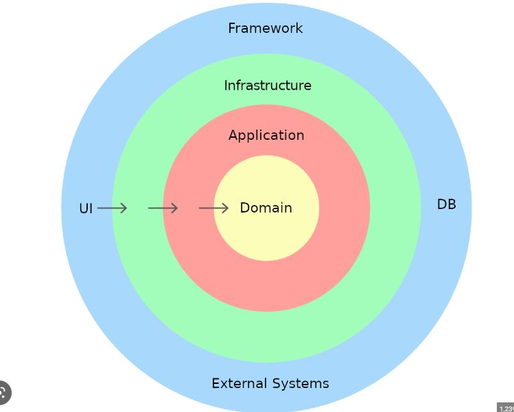
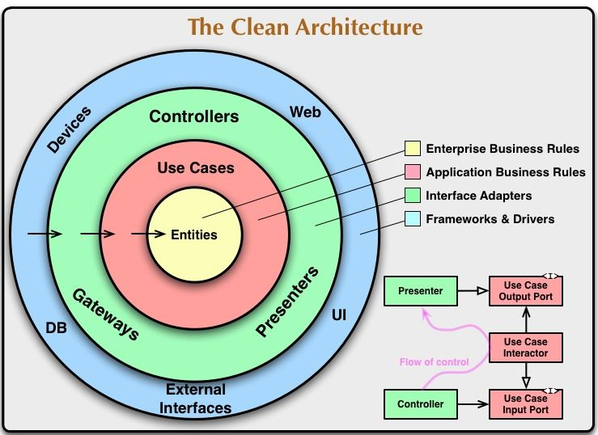
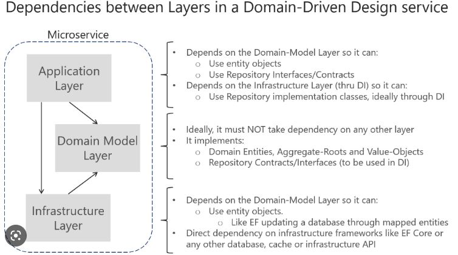

<h1> Study of Spring Boot Unit Testing with JUnit, Mockito and MockMvc </h1>  

<h2>Description English</h2>

This Project is to improve my knowledge using DDD, applying the techniques i learned through studying DDD, 
Domain-Driven Design(DDD) is a collection of principles and patterns that help developers
 craft elegant object systems. Properly applied it can lead to software abstractions called domain models. 
These models encapsulate complex business logic, closing the gap between business reality and code.

 
<h2>Descrição português</h2>
Este projeto é para aprimorar meus conhecimentos usando DDD, aplicando as técnicas que aprendi estudando DDD,
Domain-Driven Design (DDD) é uma coleção de princípios e padrões que ajudam os desenvolvedores
  crie sistemas de objetos elegantes. Aplicado corretamente, pode levar a abstrações de software chamadas de modelos de domínio.
Esses modelos encapsulam lógica de negócios complexa, fechando a lacuna entre a realidade de negócios e o código.

 

 
 

## Linkedin Below - Linkedin ABaixo

<h4 align="center">
   Created by   <a href="https://www.linkedin.com/in/luiz-carlos-b50693173/" target="_blank"> Luiz Carlos </a>
</h4>

</html>
